# Student Grading System — Java-based Educational Management

**A comprehensive student grading and management system built in Java.**

---

## 🎓 Overview

This project is a full-featured **student grading and academic management system** designed for educational institutions. It manages students, courses, grades, and generates reports for tracking academic progress and performance analytics.

- **Student Management:** Manage students, enrollment, and personal information.
- **Course Management:** Create and manage courses with instructors and semester schedules.
- **Grade Tracking:** Record and calculate grades with weighted components (assignments, exams, projects).
- **Report Generation:** Generate GPA reports, academic transcripts, and performance analytics.
- **Modular Architecture:** Clean separation of concerns with UI, business logic, and data layers.

---

## 📋 What's Inside

✓ **Student & Course Management** — Add, update, and remove students and courses
✓ **Grade Calculation Engine** — Weighted grade calculations with multiple assessment types
✓ **Reporting System** — Generate transcripts, GPA reports, and performance summaries
✓ **Data Persistence** — Store grades and academic records persistently
✓ **User-friendly Interface** — Easy-to-navigate UI for administrators and instructors
✓ **Clean Architecture** — Modular design separating presentation, business logic, and data access

---

## 📊 System Architecture

### High-Level Overview


**Flow (typical):**

1. **Instructor/Admin** opens the UI to enter grades or manage students.
2. **UI Layer** collects input and sends requests to the **Business Logic Layer**.
3. **Business Logic** validates and processes the data (e.g., calculates GPA).
4. **Data Access Layer** persists or retrieves data from the **Database**.
5. **Service** returns results back to the **UI** for display.

---

## 🔄 Core Operation: Grade Entry Sequence


---

## 🔄 Core Operation: GPA Calculation Sequence

```mermaid
sequenceDiagram
    participant Admin
    participant ReportUI as Report UI
    participant ReportService as Report Service
    participant GradeService as Grade Service
    participant StudentDAO as Student DAO
    participant GradeDAO as Grade DAO
    participant DB as Database

    Admin->>ReportUI: Generate GPA Report<br/>student: STU001
    activate ReportUI
    ReportUI->>ReportService: generateGPAReport(studentId)
    deactivate ReportUI
    
    activate ReportService
    ReportService->>StudentDAO: getStudent(STU001)
    activate StudentDAO
    StudentDAO->>DB: SELECT * FROM students WHERE id=STU001
    DB-->>StudentDAO: Student data
    deactivate StudentDAO
    StudentDAO-->>ReportService: Student object
    
    ReportService->>GradeDAO: getAllGradesByStudent(STU001)
    activate GradeDAO
    GradeDAO->>DB: SELECT * FROM grades WHERE student_id=STU001
    DB-->>GradeDAO: All grades
    deactivate GradeDAO
    GradeDAO-->>ReportService: List<Grade>
    
    ReportService->>GradeService: calculateGPA(grades)
    activate GradeService
    GradeService->>GradeService: Sum all grades × credit hours
    GradeService->>GradeService: Divide by total credit hours
    GradeService-->>ReportService: GPA: 3.75
    deactivate GradeService
    
    ReportService->>ReportService: Format report with GPA
    deactivate ReportService
    ReportService-->>ReportUI: Report generated
    ReportUI-->>Admin: Display GPA report
```



---

## 🎯 Student Enrollment Sequence


---

## 📈 Grade Distribution (Class Performance)


---

## 📁 Project Structure

```
StudentGradingSystem/
├── src/
│   ├── models/
│   │   ├── Student.java
│   │   ├── Course.java
│   │   └── Grade.java
│   ├── services/
│   │   ├── StudentService.java
│   │   ├── CourseService.java
│   │   ├── GradeService.java
│   │   └── ReportService.java
│   ├── dao/
│   │   ├── StudentDAO.java
│   │   ├── CourseDAO.java
│   │   └── GradeDAO.java
│   ├── ui/
│   │   ├── StudentManagementUI.java
│   │   ├── CourseManagementUI.java
│   │   ├── GradeEntryUI.java
│   │   └── ReportGenerationUI.java
│   └── Main.java
├── database/
│   └── schema.sql
├── README.md
└── .gitignore
```

---

## 🔧 Prerequisites

- **JDK 17+** (`java -version`)
- **IDE:** IntelliJ IDEA, Eclipse, or NetBeans
- **Database:** SQL Server, MySQL, or PostgreSQL (optional, depends on implementation)
- **Build Tool:** Maven or Gradle (if used)

---

## 🚀 Quick Start

### 1) Clone the Repository

```bash
git clone https://github.com/MahmoudHaifawi/StudentGradingSystem.git
cd StudentGradingSystem
```

### 2) Open in IDE

- Open the project in IntelliJ IDEA or your preferred IDE
- Set **Project SDK** to **JDK 17+**

### 3) Build the Project

```bash
javac -d out src/**/*.java
```

### 4) Run the Application

```bash
java -cp out Main
```

---

## 📊 Core Features

### Student Management
- Add, update, and remove students
- Track enrollment history
- Manage student contact information

### Course Management
- Create courses with instructors
- Define credit hours and course prerequisites
- Manage course schedules and sections

### Grade Management
- Enter and update grades for different assessment types
- Calculate weighted grades
- Track grade trends over semesters

### Reporting
- Generate transcripts
- Calculate and display GPA
- Performance analytics and statistics
- Export reports to PDF/Excel (if implemented)

---

## 🧪 Testing

### Unit Tests
- Test grade calculation logic
- Test GPA computation
- Test student enrollment validation

### Integration Tests
- Test database operations
- Test end-to-end grade entry workflows
- Test report generation

### Manual Tests
- Test UI interactions
- Verify data persistence
- Check report accuracy

---

## 🛠 Troubleshooting

| Issue | Solution |
|-------|----------|
| Database connection failed | Check database credentials and connection string in config |
| Grades not saving | Verify DAO implementation and database schema |
| GPA calculation incorrect | Review grade weighting logic and credit hours |
| UI not displaying data | Check service layer returns and UI binding |

---

## 🗺 Roadmap

- [ ] Database integration (JDBC/JPA)
- [ ] REST API endpoints for grades and students
- [ ] Authentication and authorization
- [ ] Advanced reporting (charts, graphs)
- [ ] Email notifications for grade updates
- [ ] Mobile app companion
- [ ] Integration with Learning Management Systems (LMS)

---

## 🤝 Contributing

- Follow Java naming conventions and best practices
- Write unit tests for new features
- Keep models, services, and DAOs loosely coupled
- Document complex business logic
- Submit focused pull requests with clear descriptions

---

## 📚 Key Concepts Implemented

- **OOP Principles:** Encapsulation, inheritance, polymorphism
- **Design Patterns:** DAO pattern, Service layer, Factory pattern
- **CRUD Operations:** Create, Read, Update, Delete functionality
- **Data Validation:** Input validation and business rule enforcement
- **Exception Handling:** Graceful error management

---

## 📄 License

This project is open source and available for educational purposes.

---

**Happy grading! 📚✨**
